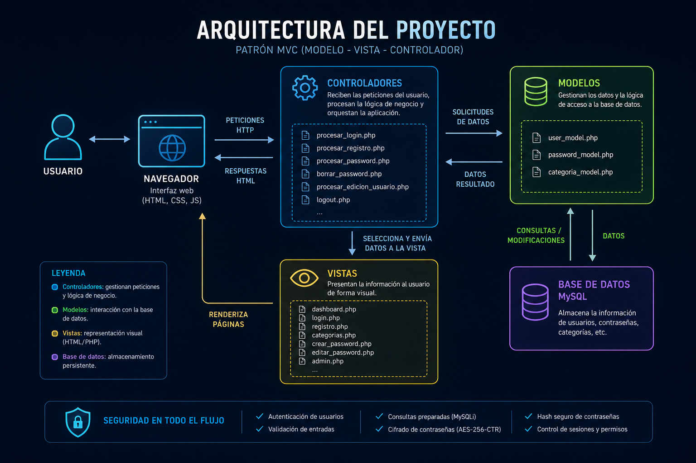
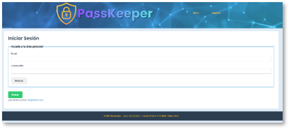
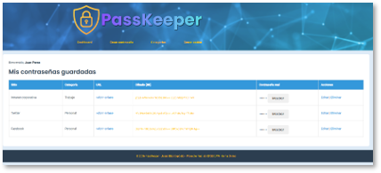
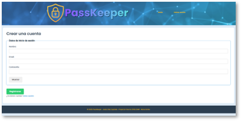
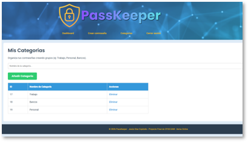
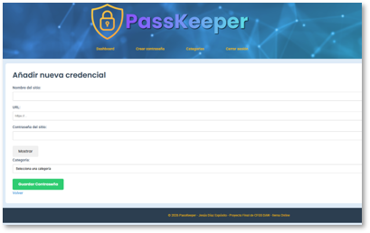
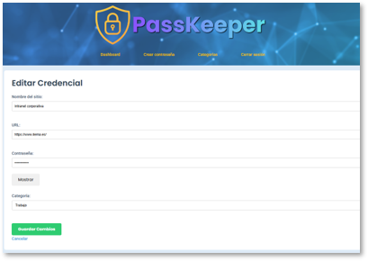
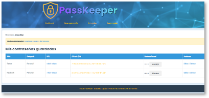

# 🔐 PassKeeper

<p align="center">
  
</p>

<p align="center">


</p>

<p align="center">
A secure password manager built with <strong>PHP</strong> and <strong>MySQL</strong>, following the <strong>MVC architectural pattern</strong> and applying modern security practices.
</p>

> 🇪🇸 **¿Prefieres leer la documentación en español?** Consulta **README.es.md** (próximamente).

---

# 📖 Table of Contents

* [Overview](#-overview)
* [Why PassKeeper?](#-why-passkeeper)
* [Features](#-features)
* [Screenshots](#-screenshots)
* [Architecture](#-architecture)
* [Technology Stack](#-technology-stack)
* [Project Structure](#-project-structure)
* [Security](#-security)
* [Database Design](#-database-design)
* [Installation](#-installation)
* [Roadmap](#-roadmap)
* [Author](#-author)
* [License](#-license)

---

# 📌 Overview

**PassKeeper** is a secure password management web application developed as the final project for the **Higher Vocational Training Programme in Web Application Development (CFGS DAW)**.

The project demonstrates how a complete web application can be built using native PHP without frameworks, applying software architecture principles, database design and secure development practices.

Its main goal is to provide a simple and secure environment where users can store, organize and manage their credentials.

---

# 💡 Why PassKeeper?

Managing dozens of online accounts has become part of everyday life.

PassKeeper was created to explore how password managers work internally while applying practical knowledge in:

* Object-oriented web development
* MVC architecture
* Database design
* User authentication
* Cryptography
* Secure coding practices

Rather than focusing only on functionality, the project was designed with security as one of its core principles.

---

# ✨ Features

* User registration and authentication.
* Secure login system.
* Password vault management.
* Password encryption using AES-256-CTR.
* Category management.
* Administrator role.
* User management (administrator only).
* Responsive interface.
* MVC architecture.
* Creation and modification timestamps.
* Session-based authentication.

---

# 🖼 Screenshots

|               Login               |               Dashboard               |
| :-------------------------------: | :-----------------------------------: |
|  |  |

|               Register               |               Categories               |
| :----------------------------------: | :------------------------------------: |
|  |  |

|               Create Password              |                Edit Password                |
| :----------------------------------------: | :-----------------------------------------: |
|  |  |

|           Administration          |
| :-------------------------------: |
|  |

---

# 🏗 Architecture

The application follows the **Model–View–Controller (MVC)** pattern to clearly separate responsibilities between presentation, business logic and data access.

```
User
   │
Browser
   │
Controllers
 ├─────────────┐
 │             │
Models      Views
 │
MySQL Database
```

This architecture improves:

* Maintainability
* Scalability
* Code organization
* Separation of concerns

---

# 💻 Technology Stack

| Technology | Purpose                  |
| ---------- | ------------------------ |
| PHP 8.2    | Backend                  |
| MySQL      | Database                 |
| HTML5      | Structure                |
| CSS3       | Styling                  |
| JavaScript | Client-side interactions |
| MySQLi     | Database access          |
| OpenSSL    | Credential encryption    |

---

# 📂 Project Structure

```
PassKeeper
│
├── assets/
│   ├── screenshots/
│   └── styles.css
│
├── config/
│   ├── db.example.php
│   └── crypto.example.php
│
├── controllers/
│
├── models/
│
├── views/
│
└── database/
```

---

# 🔒 Security

Security was one of the main design goals of this project.

### User authentication

* Passwords are hashed using `password_hash()`.
* Authentication uses `password_verify()`.

### Password encryption

Stored credentials are encrypted using:

* AES-256-CTR
* Random Initialization Vector (IV) generated for every password
* OpenSSL

This means the stored passwords are **encrypted**, not simply hashed, allowing authorized users to recover their credentials when needed.

### Database security

* Prepared Statements (MySQLi)
* SQL Injection mitigation
* UTF-8 (`utf8mb4`) support

### Access control

Two different roles are implemented:

* Administrator
* Standard User

Administrators can manage user accounts, while standard users can only manage their own credentials.

### Sensitive configuration

Sensitive configuration files are **not included** in the repository.

Instead, template files are provided:

```
config/db.example.php
config/crypto.example.php
```

This prevents exposing database credentials or encryption keys.

### Production considerations

In a production environment, the encryption key should never be stored inside the source code.

A more robust solution would involve:

* Environment variables
* Secret management services
* Key rotation policies

---

# 🗄 Database Design

Each stored credential contains:

| Field              | Description             |
| ------------------ | ----------------------- |
| id                 | Unique identifier       |
| nombre_sitio       | Website or service name |
| url_sitio          | Website URL             |
| password_cifrada   | Encrypted password      |
| id_usuario         | Owner                   |
| id_categoria       | Category                |
| fecha_creacion     | Creation date           |
| fecha_modificacion | Last modification       |

---

# 🚀 Installation

Clone the repository:

```bash
git clone https://github.com/Jediex69/PassKeeper.git
```

Configure the application:

1. Copy:

```
config/db.example.php
```

to

```
config/db.php
```

2. Copy:

```
config/crypto.example.php
```

to

```
config/crypto.php
```

3. Configure your database connection.

4. Import the SQL database into MySQL.

5. Run the project using XAMPP (Apache + MySQL).

---

# 🚧 Roadmap

Future improvements planned:

* CSRF protection
* Two-Factor Authentication (2FA)
* Environment variables
* Secret manager integration
* Password strength meter
* Advanced password generator
* Secure import/export
* Audit logging
* REST API

---

# 👨‍💻 Author

**Jesús Díaz**

Web Application Developer & Cybersecurity Enthusiast

GitHub:

https://github.com/Jediex69

---

# 📄 License

This project is licensed under the **MIT License**.
